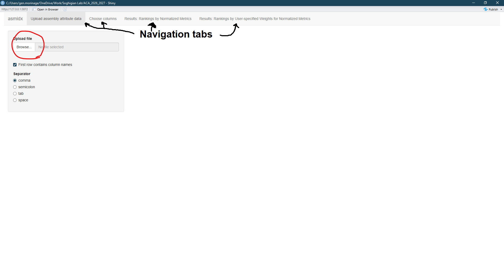
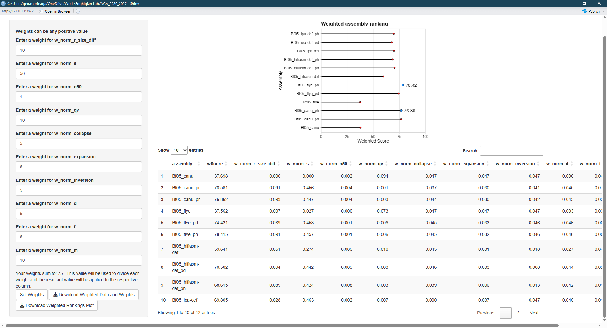
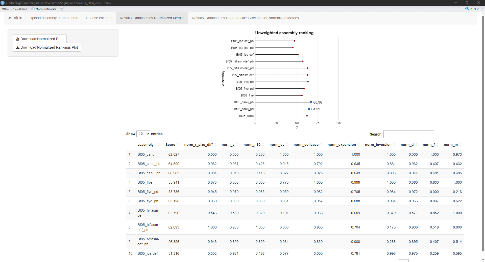

Created Nov. 2025 by Gen Morinaga

## Introduction
`asmidx` is an R package/function that I wrote to try to rank different draft genome assemblies using user-defined genome metrics because I had a hard time deciding which draft assembly to use for downstream processes.  

## The problem
Given a set of whole genome sequencing reads (Illumina, HiFi, ONT, etc.), we have the option to choose from a constellation of programs that will take the reads, stitch them together using some algorithm, and output a de novo draft genome assembly. The vast majority of these programs perform VERY well and are rigorously tested, both on "toy" and real-world datasets. However, they don't all output the same thing for a given set of reads, and they each perform differently on different sets of reads. Furthermore, it may not be enough to simply pass the reads to an assembler—we often have to use other programs to further improve the assembly (e.g., remove haplotigs, polish using higher accuracy reads, scaffolding).  These additional bioinformatic "touches" further alter the draft assembly and their outputs are not necessarily the same and can vary in their quality.

One solution is to simply stick with one set of programs that you like and only use that, but what happens if your program-of-choice outputs an assembly that is subpar? My preference is to try different program combinations to see which combination outputs the "best" assembly.

## Aggregating genome assembly metrics from different programs and sources
There is no shortage of programs that output numerous genome assembly metrics when fed an assembly file. Many programs are able to take as input many genome assemblies and output data that are tabular—variables (i.e., metrics) as columns and observations (i.e., individual assemblies) as rows. Unfortunately, not all programs do this. Three programs that unfortunately do not output tabular data that I use regularly are BUSCO, compleasm, and Inspector. 

To help with this, I wrote four wrappers functions used to help import/format outputs from BUSCO (`busco.df()`), compleasm (`comp.df()`), and inspector (`insp_stbed2df()` and `insp_sum2df()`).

**You don't need to use of these functions if you already have metrics in table and saved as a file with column headers**

### `busco.df` and `comp.df`
Benchmarking Universal Single Copy Orthologs (BUSCO) is a very commonly used program which helps the user a get sense of the completeness of a genome assembly. It does so by searching the query genome for single copy orthologs found "universally" in the particular taxonomic group that it belongs. One of its many outputs is a short summary, which is typically has the file name `short_summary.specific.SOME_ODB_SET.assmblyname.txt`. Where, "SOME_ODB_SET" refers to whichever ODB dataset you used and "assemblyname" is your assembly. It's contents are as follows:
```
# BUSCO version is: 5.2.2 
# The lineage dataset is: diptera_odb10 (Creation date: 2020-08-05, number of genomes: 56, number of BUSCOs: 3285)
# Summarized benchmarking in BUSCO notation for file /scratch/15428803/assemblies/Bf05.contigs.fasta
# BUSCO was run in mode: genome
# Gene predictor used: metaeuk

	***** Results: *****

	C:97.6%[S:5.7%,D:91.9%],F:1.0%,M:1.4%,n:3285	   
	3208	Complete BUSCOs (C)			   
	188	Complete and single-copy BUSCOs (S)	   
	3020	Complete and duplicated BUSCOs (D)	   
	33	Fragmented BUSCOs (F)			   
	44	Missing BUSCOs (M)			   
	3285	Total BUSCO groups searched		   

Dependencies and versions:
	hmmsearch: 3.3
	metaeuk: 9818d1a5b155c28b3ef11bfa9b7c69073e669a70
```
This output is super helpful, but since it isn't tabular (i.e., data arranged in rows and columns), it's kind of a pain to copy-paste into a spreadsheet. 

`busco.df` will read this summary output and parse it into a table that's easier to work with in R or your favorite spreadsheet program. It takes the file name of the short summary and can optionally be fed an assembly name. The default is to simply take the assembly name from the summary file name. 
```
busco.df('short_summary.specific.diptera_odb10.Bf05_canu.fasta.txt')
   assembly    c   s    d  f  m    t c_percent s_percent d_percent f_percent m_percent
1 Bf05_canu 3208 188 3020 33 44 3285      97.7       5.7      91.9         1       1.3

busco.df('short_summary.specific.diptera_odb10.Bf05_canu.fasta.txt', assembly.name = 'COOL NAME')
   assembly    c   s    d  f  m    t c_percent s_percent d_percent f_percent m_percent
1 COOL NAME 3208 188 3020 33 44 3285      97.7       5.7      91.9         1       1.3
```
This is great for a *single* assembly, but what if you have **many** BUSCO summaries (and/or didn't have foresight to run BUSCO in batch mode)?

In that case, you can use this `busco.df` in a `for` loop, or `lapply` combined with `do.call`. My preference is the latter, so that's what I will show. Assuming all of your BUSCO short summary files are in the current working directory:

```
do.call('rbind', lapply(list.files(pattern = 'short_summary'), busco.df))
          assembly    c    s    d  f  m    t c_percent s_percent d_percent f_percent m_percent
1        Bf05_canu 3208  188 3020 33 44 3285      97.7       5.7      91.9       1.0       1.3
2        Bf05_flye 3199  356 2843 43 43 3285      97.4      10.8      86.5       1.3       1.3
3 Bf05_hifiasm-def 3205 1869 1336 37 43 3285      97.6      56.9      40.7       1.1       1.3
4     Bf05_ipa-def 3174 3030  144 53 58 3285      96.6      92.2       4.4       1.6       1.8
```

`comp.df` is basically the same function as `busco.df`, but specific to `compleasm` short summaries. `compleasm` is an implementation of BUSCO that is faster (in my experience) and more sensitive. It has very similar outputs, albeit more streamlined:
```
## lineage: diptera_odb10
S:97.53%, 3204
D:1.58%, 52
F:0.43%, 14
I:0.00%, 0
M:0.46%, 15
N:3285
```
The pain here, is that `compleasm` simply names this output `summary.txt` so you'll want to take care to rename each file for each assembly. Running `comp.df` on a `compleasm` summary file will output the following:

```
comp.df('Bf05_summary.txt')
   D  F I  M    N    S S_percent D_percent F_percent I_percent M_percent
1 52 14 0 15 3285 3204     97.53      1.58      0.43         0      0.46
```


### `insp_stbed2df`  and `insp_sum2df`
Inspector is a useful program that tries to identify errors in the assembly by mapping the reads back to assembly, while also outputting summary metrics like genome size, N50, L50, # of contigs, etc. 

The `summary_statsitics` file contains summary information, but it's not conducive to reading into `R`.
```
Statics of contigs:
Number of contigs	3021
Number of contigs > 10000 bp	2731
Number of contigs >1000000 bp	667
Total length	2491516991
Total length of contigs > 10000 bp	2489027438
Total length of contigs >1000000bp	2255933315
Longest contig	28249338
Second longest contig length	23376325
N50	3998863
N50 of contigs >1Mbp	3998863


Read to Contig alignment:
Mapping rate /%	100.0
Split-read rate /%	0.33
Depth	30.8112
Mapping rate in large contigs /%	91.01
Split-read rate in large contigs /%	0.31
Depth in large conigs	30.9479


Structural error	6
Expansion	5
Collapse	0
Haplotype switch	1
Inversion	0


Small-scale assembly error /per Mbp	0.73844103602
Total small-scale assembly error	1838
Base substitution	994
Small-scale expansion	288
Small-scale collapse	556

QV	57.0363348088

```

Using `asmidx::insp_sum2df`, we can make the summary output tabular.

```
insp_sum2df("Bf05_canu_insp_summary_statistics")
Number_of_contigs Number_of_contigs__10000_bp Number_of_contigs_1000000_bp Total_length
1              3487                        3328                          699   2387947053
  Total_length_of_contigs__10000_bp Total_length_of_contigs_1000000bp Longest_contig Second_longest_contig_length
1                        2386691652                        2020968384       24845927                     15337498
      N50 N50_of_contigs_1Mbp Mapping_rate Split.read_rate   Depth Mapping_rate_in_large_contigs
1 2992577             2992577        90.75            3.06 17.3114                         72.71
  Split.read_rate_in_large_contigs Depth_in_large_conigs num_Structural_error num_Expansion num_Collapse
1                             0.48               16.6675                   10             6            4
  num_Haplotype_switch num_Inversion Small.scale_assembly_error_.per_Mbp Total_small.scale_assembly_error
1                    0             0                            3.911272                             9335
  Base_substitution Small.scale_expansion Small.scale_collapse       QV       assembly
1              2485                  6127                  723 52.44672 Bf05_canu_insp
```
Just as with `busco.df` and `comp.df`, this only reads a single file, and thus outputs a single row. If you have multiple summary files that need to be compiled together into tabular format, you can again use this function in a `for` loop or `do.call` + `lapply` combination. The latter comes more naturally to me so that's what I'll show below.

Assuming your summary statistics from `Inspector` are consistently named and contain `summary_statistics` in the name you can do the following:
```
do.call('rbind', lapply(list.files(pattern = 'summary_statistics'), insp_sum2df))
```

Which will output the following:

```
  Number_of_contigs Number_of_contigs__10000_bp Number_of_contigs_1000000_bp Total_length Total_length_of_contigs__10000_bp Total_length_of_contigs_1000000bp
1              3487                        3328                          699   2387947053                        2386691652                        2020968384
2               929                         856                          332   1250917201                        1250367256                        1152315311
3               969                         899                          324   1274299322                        1273761411                        1171701722
4              5016                        4494                          691   2309630905                        2306704002                        1529061990
5              2075                        1963                          363   1232554354                        1231925177                         882529126
6              2005                        1939                          367   1249147207                        1248781532                         899054645
  Longest_contig Second_longest_contig_length     N50 N50_of_contigs_1Mbp Mapping_rate Split.read_rate   Depth Mapping_rate_in_large_contigs
1       24845927                     15337498 2992577             2992577        90.75            3.06 17.3114                         72.71
2       24845927                     15337498 4140123             4140123        90.67           39.00 33.0205                         78.48
3       24845927                     15337498 4249676             4249676        90.52           38.17 32.3786                         78.31
4       11613685                     10557214 1640339             1640339        90.44            4.69 17.8913                         55.33
5       11613685                     10557214 2021403             2021403        90.42           40.92 33.4948                         59.72
6       11613685                     10557214 2045421             2045421        89.59           40.29 32.8690                         59.96
  Split.read_rate_in_large_contigs Depth_in_large_conigs num_Structural_error num_Expansion num_Collapse num_Haplotype_switch num_Inversion
1                             0.48               16.6675                   10             6            4                    0             0
2                            39.25               31.5376                 1408           298           73                 1030             7
3                            38.47               30.9522                 1344           289           60                  992             3
4                             0.82               16.7469                   26            19            7                    0             0
5                            41.39               31.3221                 1115           215           41                  851             8
6                            40.63               30.8646                 1094           223           42                  821             8
  Small.scale_assembly_error_.per_Mbp Total_small.scale_assembly_error Base_substitution Small.scale_expansion Small.scale_collapse       QV          assembly
1                            3.911272                             9335              2485                  6127                  723 52.44672    Bf05_canu_insp
2                           96.430868                           120574            105986                  8704                 5884 29.62157 Bf05_canu_pd_insp
3                           90.451005                           115213            100800                  8782                 5631 29.88294 Bf05_canu_ph_insp
4                           15.674746                            36157             27135                  5601                 3421 47.22910    Bf05_flye_insp
5                           95.701429                           117897            104914                  6400                 6583 30.64053 Bf05_flye_pd_insp
6                           91.060764                           113715            101127                  6175                 6413 30.67232 Bf05_flye_ph_insp
```

Once each of these tables have been created, you should merge them together into a single object by assembly name and save it as a file somewhere. It doesn't matter whether it's a csv or tab-delimited file—either will work. Things will be much easier downstream if you save it with file headers.

## Using `asmidx`
Invoking `asmidx()` will launch a GUI which will look like the following:


The intent behind `asmidx()` is to emphasize ease of use, hence the point-and-click interface. Along the top, are navigation tabs that you can click to see different/do different things to your data. 

#### Uploading your assembly metrics
Clicking on 'Browse' (circled in red in [Fig1.png|Figure 1]) will prompt you navigate to the file containing assembly metrics. Once you've chosen your file, you will be shown a preview table of the contents in the file on the right side. You can specify if the file has a header row (I *highly recommend* that you do include it when you create your data) and how entries are delimited. If your files are CSV (columns separated by commas [,]), then choose 'comma'. I've listed other commonly used delimiters, so choose the one that makes sense for your data.

#### Choose which columns to include to assess genome quality
Once the data are uploaded, proceed to the "Choose columns" tab. Here, you choose which set of columns you want to include to compare your draft assemblies, using a drop-down style menu. Each drop-down will contain all column names in the data set you're using; you can select a column by clicking on it in each drop-down. If you want to de-select, you can click on the name again and it will be removed. See below for a breakdown of each drop-down:

| Drop-down                        | # Columns to choose | Description/Example                                                                                                                     |
| -------------------------------- | ------------------- | --------------------------------------------------------------------------------------------------------------------------------------- |
| ID column                        | 1                   | The column that contains identifiers for each assembly.                                                                                 |
| Columns where<br>higher = better | Any                 | These are metrics you would consider to be 'good'.<br>Example: BUSCO single copy, N50                                                   |
| Columns where<br>lower = better  | Any                 | These are metrics you would consider to be 'bad'.<br>Example: BUSCO missing, inversions                                                 |
| Assembly size                    | 1 (optional)        | The column that contains total size of the assembly                                                                                     |
| Known size                       | not a column        | A genome size you want to compare to (in bp); will use<br>this value to calculate a relative size difference, where<br>lower is better. |



Once you've chosen your columns, you can hit the 'Choose these columns' button (circled in red in [[Fig2.png|Fig. 2]]) and it will output a table of the columns you've chosen to use as part of your assembly metric. Once you're happy with your choices move on to the "Results: Rankings by Normalized Metrics" tab.

#### Normalized rankings
To rank the draft assemblies using the user-defined set of metrics, we feature normalize each chosen column. This results in each assembly getting a score that ranges 0–1, where 1 is the best score and 0 is the worst score for the set. The total score is the average of all across of these columns, multiplied by 100 to make interpreting the score intuitive.

This tab will display a lollipop plot of the scores and a table of the normalized scores. The user can save both the normalized data and the plot by clicking their respective buttons on the left.



#### Weighted rankings
Are all metrics equally important? This may not be the case in all situations and datasets. If some metrics are more important, they should be weighted. You can do this with `asmidx()`  on the last tab, "Rankings by user-specified weights". Here, you can enter any numerical value for each metric in your scoring scheme. The weights don't need to sum to anything specific. The important thing to keep in mind is that these are **relative importance**—if you think BUSCO single copy ortholog counts are 50x more important than the N50, then you can type 50 in BUSCO S and 1 in N50.

Just as with the normalized weights, you can download and save the plot and table using the buttons at the bottom.


### Which metrics and what weights should I use?
This can get tricky—it really depends on what you think is are good indicators of genome quality. I think obvious metrics to include are things like **N50, L50, BUSCOs, and relative size**. Relative size gives you a sense of how different your draft is from the estimated or known genome size. N50 and L50 give you a sense of contiguity. BUSCOs give you a sense of the gene content completeness. It's worth noting though that some metrics are somewhat redundant: BUSCO missing and BUSCO complete tell you very similar things—the presence or absence of a single copy ortholog that *SHOULD* be there.

Error metrics could also be very helpful in evaluating which assembly you choose for downstream analysis, which is why I've written wrapper scripts for handling output from Inspector. Errors introduced at the assembly stage will be propagated and lead to erroneous inference, so if you're able to quantify what errors exist in the assembly it's worth knowing.

Lastly, the weights you apply to the metrics you choose is entirely up to you—that's not very helpful, I know. As I mentioned above, the important thing to keep in mind is the relative importance of each metric to another. Is the metric based on outside evidence (e.g., a reference genome size or sets of proteomes [BUSCO]), or is it self-referential (e.g., N50)? Is the known genome size a well established one for your organism? Does your organism belong to a group that is well-sampled in BUSCO (e.g., Diptera), or are you relying on an OrthoDB set that is more general (Eukaryota)?
